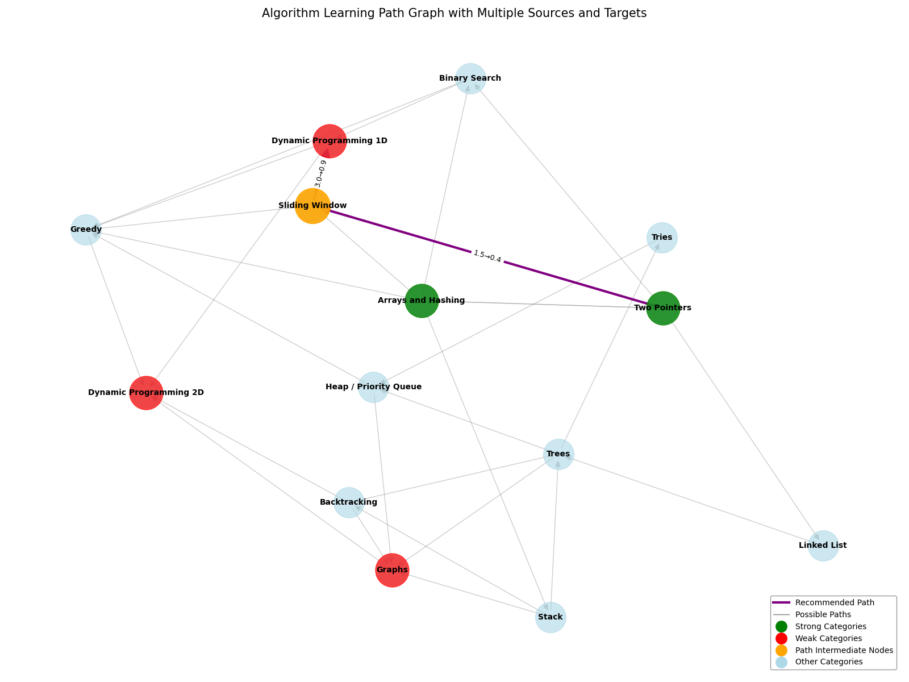

# LeetCoderrr: Personalized LeetCode Problem Recommendation System

LeetCoderrr is an intelligent recommendation system that helps users improve their algorithm and data structure problem-solving skills by providing personalized LeetCode problem recommendations based on their strengths, weaknesses, and learning progress.

## Features

- **Personalized Recommendations**: Get problem recommendations tailored to your current skill level and learning progress
- **Category-Based Learning Path**: Follow an optimized learning path from your strengths to your weak areas
- **Problem Evaluation**: AI-powered evaluation of your solutions with detailed feedback
- **Performance Tracking**: Track your progress across different problem categories
- **Visualization**: Visual representation of your learning path and progress

## System Architecture

The system consists of several components:

1. **Recommendation System**: Core engine that analyzes user progress and suggests problems
2. **Problem Tree**: Hierarchical organization of problems by difficulty and category
3. **Category Graph**: Graph representation of relationships between different problem categories
4. **Solution Evaluation**: AI-powered solution evaluation using OpenAI's GPT models

## Installation

1. Clone the repository:
   ```
   git clone https://github.com/your-username/leetcoderrr.git
   cd leetcoderrr
   ```

2. Install dependencies:
   ```
   pip install -r requirements.txt
   ```

3. Set up OpenAI API key:
   Create a `.env` file in the project root directory and add your OpenAI API key:
   ```
   OPENAI_API_KEY="your-api-key-here"
   ```

## Usage

### Getting Recommendations

```python
from recommendation_system import RecommendationSystem

# Initialize recommendation system
recommender = RecommendationSystem()

# Get recommendations
python recommendation_system.py

### Visualizing Learning Path

python category_graph.py
python show_learning_path.py

The learning path visualization shows:
- Your strong categories (where you excel)
- Your weak categories (areas for improvement)
- An optimal learning path from your strengths to your weaker areas
- Detailed analytics on why certain categories are recommended next

The system uses Dijkstra's algorithm on a weighted category graph, where the weights are dynamically adjusted based on your performance metrics. This produces a personalized learning journey that maximizes your learning efficiency.



## Project Structure

- `recommendation_system.py`: Core recommendation engine
- `problem_tree.py`: Hierarchical problem organization
- `category_graph.py`: Category relationship graph implementation
- `show_learning_path.py`: Learning path visualization
- `problems.json`: Database of LeetCode problems
- `user_progress.json`: User progress tracking
- `solutions/`: Directory for user solutions
- `requirements.txt`: Project dependencies

## Algorithm

The recommendation system uses a multi-faceted approach:

1. **For new users**: Recommendations based on standard learning progression
2. **For experienced users**: Analysis of performance patterns to identify areas of improvement
3. **Personalized path finding**: Dijkstra's algorithm on the category graph to find optimal learning paths

The dynamic weight calculation for each category considers:
- Your success rate in solving problems in that category
- The average quality of your solutions (based on AI evaluation)
- The time you typically spend on problems in that category

## User Profiles

The system supports different types of user profiles:

- **New User**: Starting with basic problems, gradually introducing different categories new_user.json
- **Regular User**: Balanced recommendations across categories with adjustments based on performance regular_user.json
- **Weakness-focused User**: Targeted recommendations to improve specific weak areas weakness_user.json

## Requirements

- Python 3.8+
- OpenAI API key (for solution evaluation)

## License

[MIT License](LICENSE) 